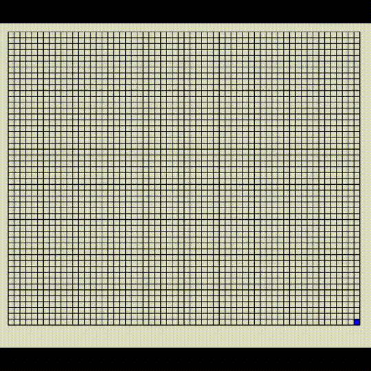
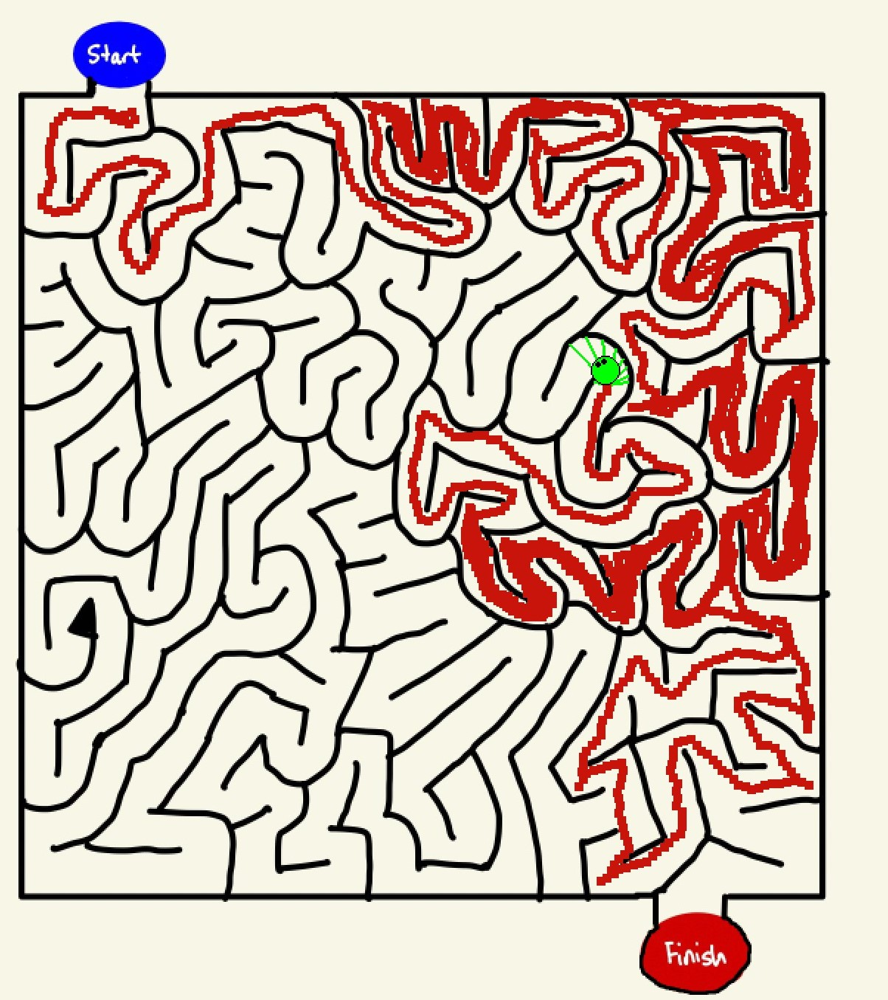

# Author: Levi sawatzky

## maze_grid.py:  
creates and solves grid shaped mazes in a visually appealing way

## mazeman.py:
uses line of sight distance and weighted probability to effectively explore hand-drawn mazes

